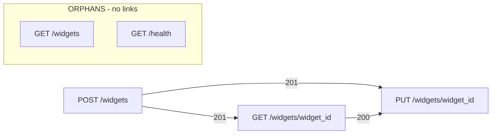

# api-parity

Differential fuzzing tool for comparing two API implementations against an OpenAPI specification. Find where they differ, replay failures to verify fixes. Perfect for API rewrites.

## Status

**Ready for use** — Both `explore` and `replay` subcommands are fully implemented. Supports stateless single-request testing and stateful chain testing via OpenAPI links. See ARCHITECTURE.md and DESIGN.md for technical details.

**Languages:** Python (primary), Go (CEL evaluator subprocess)

## Why

API migration is hard. You have a working API, you're rewriting it, and you need to know: does the new implementation behave exactly like the old one? Existing tools solve pieces of this problem but don't combine them for migration workflows. api-parity focuses specifically on differential testing between two implementations with replayable failure artifacts.

## Installation

api-parity is distributed as source and must be built locally. This is required because the tool includes a Go binary (CEL evaluator) that must be compiled for your platform.

### Prerequisites

- **Python 3.10+** — Primary runtime
- **Go 1.21+** — Required to build the CEL evaluator binary
- **pip** — Python package installer

### Build from Source

```bash
# Clone the repository
git clone https://github.com/j-tyler/api-parity.git
cd api-parity

# Run the build script (installs Python deps + builds Go binary)
./scripts/build.sh

# Verify installation
api-parity --help
```

The build script will:
1. Check that Python 3.10+ and Go 1.21+ are installed
2. Install the Python package in development mode (`pip install -e .`)
3. Build the CEL evaluator binary (`./cel-evaluator`)
4. Verify the installation works

### Manual Build

If you prefer to build manually:

```bash
# Install Python package
pip install -e .

# Build CEL evaluator
go build -o cel-evaluator ./cmd/cel-evaluator

# Verify
api-parity --help
```

## Quick Start

```bash
# Explore: generate tests and find mismatches
api-parity explore \
  --spec openapi.yaml \
  --config config.yaml \
  --target-a production \
  --target-b staging \
  --out ./artifacts

# Replay: re-run saved mismatches to verify fixes
api-parity replay \
  --config config.yaml \
  --target-a production \
  --target-b staging \
  --in ./artifacts \
  --out ./replay-results
```

## Replay Workflow

The typical api-parity workflow is iterative: explore, analyze, fix, replay.

### 1. Explore and Discover Mismatches

```bash
api-parity explore \
  --spec openapi.yaml \
  --config config.yaml \
  --target-a production \
  --target-b staging \
  --out ./artifacts \
  --max-cases 100
```

### 2. Analyze Mismatch Bundles

Each mismatch in `./artifacts/mismatches/` contains:
- `case.json` — The request sent
- `target_a.json` / `target_b.json` — Responses received
- `diff.json` — Structured diff showing what differed

### 3. Update Comparison Rules or Fix API Issues

For expected differences (timestamps, UUIDs), add field rules to `default_rules.body.field_rules` in your `comparison_rules.json`:

```json
{
  "$.created_at": {"predefined": "iso_timestamp_format"},
  "$.id": {"predefined": "uuid_format"},
  "$.price": {"predefined": "numeric_tolerance", "tolerance": 0.01}
}
```

For real bugs, fix the API implementation.

### 4. Verify Fixes with Replay

```bash
api-parity replay \
  --config config.yaml \
  --target-a production \
  --target-b staging \
  --in ./artifacts \
  --out ./replay-results
```

**Output:**
```
[1] createWidget: POST /widgets FIXED
[2] updateWidget: PUT /widgets/{id} STILL MISMATCH: body mismatch at $.price
============================================================
Total bundles: 2
  Fixed (now match):     1
  Still mismatch:        1
  Different mismatch:    0
  Errors:                0

Fixed bundles:
  20260111T143052__createWidget__abc12345
```

### 5. Repeat Until All Issues Resolved

Continue the cycle until all bundles show `FIXED` or are documented as acceptable differences.

### Replay Classifications

| Classification | Meaning |
|---------------|---------|
| `FIXED` | Previously mismatched, now matches (issue resolved) |
| `STILL MISMATCH` | Same failure pattern persists |
| `DIFFERENT MISMATCH` | Fails differently than before (new issue or rules changed) |

## Configuration

### Config File (YAML)

The `--config` file defines targets, comparison rules, and optional settings:

```yaml
# Required: Define your API targets
targets:
  production:
    base_url: https://api.example.com
    headers:
      Authorization: "Bearer ${PROD_API_TOKEN}"  # Environment variable substitution
  staging:
    base_url: https://staging.api.example.com
    headers:
      Authorization: "Bearer ${STAGING_API_TOKEN}"

# Required: Path to comparison rules (JSON)
comparison_rules: ./comparison_rules.json

# Optional: Rate limiting
rate_limit:
  requests_per_second: 10.0

# Optional: Redact sensitive fields in artifacts
secrets:
  redact_fields:
    - "$.password"
    - "$.api_key"
    - "$.credentials.token"
```

### Comparison Rules (JSON)

Defines how responses are compared. See `tests/fixtures/comparison_rules.json` for a complete example.

```json
{
  "version": "1",
  "default_rules": {
    "status_code": {"predefined": "exact_match"},
    "body": {
      "field_rules": {
        "$.id": {"predefined": "uuid_format"},
        "$.created_at": {"predefined": "ignore"},
        "$.price": {"predefined": "numeric_tolerance", "tolerance": 0.01}
      }
    }
  },
  "operation_rules": {
    "getUser": {
      "body": {
        "field_rules": {
          "$.last_login": {"predefined": "ignore"}
        }
      }
    }
  }
}
```

### Predefined Comparisons

Built-in comparisons available via `{"predefined": "name"}`. In all expressions, `a` = Target A value, `b` = Target B value.

| Name | Parameters | Description |
|------|------------|-------------|
| `ignore` | — | Always passes. Field is not compared. |
| `exact_match` | — | Values must be exactly equal (`a == b`). |
| **Format Validation** |
| `uuid_format` | — | Both values are valid UUID format. Values not compared. |
| `uuid_v4_format` | — | Both values are valid UUID v4 format. Values not compared. |
| `url_format` | — | Both values are valid URL format (http/https). Values not compared. |
| `iso_timestamp_format` | — | Both values are ISO 8601 timestamps with time. Values not compared. |
| `iso_date_format` | — | Both values are ISO 8601 dates (YYYY-MM-DD). Values not compared. |
| `jwt_format` | — | Both values are valid JWT format. Values not compared. |
| `base64_format` | — | Both values are valid base64 format. Values not compared. |
| `hex_string` | — | Both values are hex strings of same length. Values not compared. |
| **Numeric** |
| `numeric_tolerance` | `tolerance` | Numbers equal within tolerance: `\|a - b\| <= tolerance` |
| `both_positive` | — | Both values are positive numbers. |
| `both_non_negative` | — | Both values are >= 0. |
| `both_integer` | — | Both values are integers (no fractional part). |
| `same_sign` | — | Both values have same sign (positive, negative, or zero). |
| `both_in_range` | `min`, `max` | Both values fall within [min, max] inclusive. |
| **Timestamps** |
| `epoch_seconds_tolerance` | `seconds` | Unix timestamps (seconds) within N seconds of each other. |
| `epoch_millis_tolerance` | `millis` | Unix timestamps (milliseconds) within N ms of each other. |
| **Strings** |
| `string_prefix` | `length` | First N characters match. |
| `string_suffix` | `length` | Last N characters match. |
| `string_contains` | `substring` | Both strings contain the specified substring. |
| `string_length_match` | — | Both strings have same length. Content not compared. |
| `string_nonempty` | — | Both strings are non-empty. Content not compared. |
| `both_match_regex` | `pattern` | Both values match the regex pattern. |
| **Arrays** |
| `unordered_array` | — | Arrays have same elements, order ignored. **WARNING:** Doesn't handle duplicates. |
| `array_length` | — | Arrays have same length. Contents not compared. |
| `array_length_tolerance` | `tolerance` | Array lengths differ by at most N elements. |
| `array_nonempty` | — | Both arrays have at least one element. |
| **Objects** |
| `same_keys` | — | Both objects have identical key sets. Values not compared. |
| `object_nonempty` | — | Both objects have at least one key. |
| **Null/Type** |
| `both_null` | — | Both values are null. |
| `both_null_or_equal` | — | Both null, or both non-null and equal. |
| `same_nullity` | — | Both null or both non-null. Values not compared. |
| `both_boolean` | — | Both values are boolean type. Values not compared. |
| `type_match` | — | Values have same type. Values not compared. |

### Custom CEL Expressions

For comparisons not covered by predefined rules, use [CEL (Common Expression Language)](https://github.com/google/cel-spec). The expression must return a boolean (`true` = match, `false` = mismatch).

Available variables:
- `a` — Value from Target A
- `b` — Value from Target B

Examples:

```json
{"expr": "a == b"}
{"expr": "size(a) == size(b)"}
{"expr": "a.startsWith(b.substring(0, 5))"}
{"expr": "a > 0 && b > 0 && (a - b) <= 10"}
```

CEL reference: [cel-spec language definition](https://github.com/google/cel-spec/blob/master/doc/langdef.md)

## CLI Reference

### `api-parity list-operations`

List all operations from an OpenAPI spec with their operationIds and links. Use this to discover operationIds for `--exclude` or `--operation-timeout`.

| Option | Required | Description |
|--------|----------|-------------|
| `--spec PATH` | Yes | Path to OpenAPI specification file (YAML or JSON) |

Example output:

```
createWidget
  POST /widgets
  Links:
    201 → GetCreatedWidget → getWidget

getWidget
  GET /widgets/{id}

listWidgets
  GET /widgets

Total: 3 operations
```

### `api-parity graph-chains`

Output a Mermaid flowchart showing OpenAPI link relationships, or show actual chains generated by Schemathesis.

| Option | Required | Description |
|--------|----------|-------------|
| `--spec PATH` | Yes | Path to OpenAPI specification file (YAML or JSON) |
| `--exclude OPERATION_ID` | No | Exclude an operation by operationId (can be repeated) |
| `--generated` | No | Show actual chains generated by Schemathesis (not just declared links) |
| `--max-chains INT` | No | Maximum chains to generate (default: 20). Only with `--generated` |
| `--max-steps INT` | No | Maximum steps per chain (default: 6). Only with `--generated` |
| `--seed INT` | No | Random seed for reproducible generation. Only with `--generated` |

**Default mode** (without `--generated`): Outputs a Mermaid flowchart showing the static link graph from the OpenAPI spec.



This shows:
- **Node ID** = operationId
- **Node label** = `METHOD /path`
- **Edge label** = HTTP status code triggering the link
- **Orphans subgraph** = operations with no inbound or outbound links

**Generated mode** (`--generated`): Shows actual chains that Schemathesis would generate during `explore --stateful`. Use this to debug why chains aren't being generated or to see which links are actually being used.

```
Generated Chains (3 chains)
============================================================

[Chain 1] createWidget -> getWidget -> updateWidget
  Steps: 3
  1. createWidget: POST /widgets
  2. getWidget: GET /widgets/{widget_id}
      via link: GetWidget (201)
  3. updateWidget: PUT /widgets/{widget_id}
      via link: UpdateWidget (200)

============================================================
Link Coverage Summary
============================================================
Total declared links: 4
Links actually used:  3
Unused links:         1
```

### `api-parity explore`

Generate test cases from an OpenAPI spec and compare responses between two targets.

| Option | Required | Description |
|--------|----------|-------------|
| `--spec PATH` | Yes | Path to OpenAPI specification file (YAML or JSON) |
| `--config PATH` | Yes | Path to runtime configuration file (YAML) |
| `--target-a NAME` | Yes | Name of first target (must exist in config `targets` section) |
| `--target-b NAME` | Yes | Name of second target (must exist in config `targets` section) |
| `--out PATH` | Yes | Output directory for mismatch artifacts |
| `--seed INT` | No | Random seed for reproducible test generation |
| `--max-cases INT` | No | Maximum number of test cases to generate |
| `--validate` | No | Validate config and spec without executing requests |
| `--exclude OPERATION_ID` | No | Exclude an operation by operationId (can be repeated) |
| `--timeout SECONDS` | No | Default timeout for each API call (default: 30s) |
| `--operation-timeout OPERATION_ID:SECONDS` | No | Set timeout for a specific operation (can be repeated) |
| `--stateful` | No | Enable stateful chain testing using OpenAPI links |
| `--max-chains INT` | No | Maximum chains to generate in stateful mode (default: 20) |
| `--max-steps INT` | No | Maximum steps per chain in stateful mode (default: 6) |
| `--log-chains` | No | Write executed chains to chains.txt for debugging (stateful mode only) |

### `api-parity replay`

Re-execute previously saved mismatch bundles to confirm whether issues persist.

| Option | Required | Description |
|--------|----------|-------------|
| `--config PATH` | Yes | Path to runtime configuration file (YAML) |
| `--target-a NAME` | Yes | Name of first target (must exist in config `targets` section) |
| `--target-b NAME` | Yes | Name of second target (must exist in config `targets` section) |
| `--in PATH` | Yes | Input directory containing mismatch bundles |
| `--out PATH` | Yes | Output directory for replay artifacts |
| `--validate` | No | Validate config and replay cases without executing requests |
| `--timeout SECONDS` | No | Default timeout for each API call (default: 30s) |
| `--operation-timeout OPERATION_ID:SECONDS` | No | Set timeout for a specific operation (can be repeated) |

### Configuration Precedence

Options can be specified in the config file or as CLI arguments. CLI arguments take precedence for that run, allowing one-off overrides without editing the config file.

## How It Works

1. Parse the OpenAPI specification
2. Generate requests (including stateful chains via OpenAPI links)
3. Send identical requests to both targets
4. Compare responses under user-defined rules
5. Write mismatch bundles for analysis and replay

## Output Format

When a mismatch is detected, api-parity writes a **mismatch bundle** — a directory containing all the information needed to understand and replay the failure.

### Bundle Structure

```
artifacts/mismatches/
  20260111T143052__createWidget__abc123/
    case.json         # The request that was sent
    target_a.json     # Response from Target A
    target_b.json     # Response from Target B
    diff.json         # Structured comparison result
    metadata.json     # Run context (tool version, targets, seed)
```

### File Contents

**case.json** — The request case (stateless) or chain case (stateful):

```json
{
  "case_id": "abc123",
  "operation_id": "createWidget",
  "method": "POST",
  "path_template": "/widgets",
  "path_parameters": {},
  "rendered_path": "/widgets",
  "query": {},
  "headers": {"content-type": ["application/json"]},
  "body": {"name": "Test Widget", "price": 19.99},
  "media_type": "application/json"
}
```

**target_a.json** / **target_b.json** — Captured response from each target:

```json
{
  "request": { ... },
  "response": {
    "status_code": 201,
    "headers": {"content-type": ["application/json"]},
    "body": {"id": "widget-001", "name": "Test Widget", "price": 19.99},
    "elapsed_ms": 45.2,
    "http_version": "1.1"
  }
}
```

**diff.json** — Structured comparison result showing what differed:

```json
{
  "match": false,
  "mismatch_type": "body",
  "summary": "Body mismatch at $.price: 19.99 vs 20.00",
  "details": {
    "status_code": {"match": true, "differences": []},
    "headers": {"match": true, "differences": []},
    "body": {
      "match": false,
      "differences": [
        {
          "path": "$.price",
          "target_a": 19.99,
          "target_b": 20.00,
          "rule": "numeric_tolerance"
        }
      ]
    }
  }
}
```

**metadata.json** — Run context for reproducibility:

```json
{
  "tool_version": "0.1.0",
  "timestamp": "2026-01-11T14:30:52Z",
  "seed": 42,
  "target_a": {"name": "production", "base_url": "https://api.example.com"},
  "target_b": {"name": "staging", "base_url": "https://staging.example.com"},
  "comparison_rules_applied": "default"
}
```

## Documentation

### User Guides

| Document | Description |
|----------|-------------|
| [Quickstart](docs/quickstart.md) | Get running in 5 minutes |
| [Configuration](docs/configuration.md) | Runtime config and CLI options |
| [Comparison Rules](docs/comparison-rules.md) | How to define field comparison logic |
| [OpenAPI Links](docs/openapi-links.md) | Enable stateful chain testing |
| [Troubleshooting](docs/troubleshooting.md) | Common errors and fixes |

### Technical Reference

| Document | Description |
|----------|-------------|
| [ARCHITECTURE.md](ARCHITECTURE.md) | System structure, data models, interfaces |
| [DESIGN.md](DESIGN.md) | Decisions and reasoning |
| [TODO.md](TODO.md) | Planned work and open questions |

## License

MIT License - see [LICENSE](LICENSE) for details.
